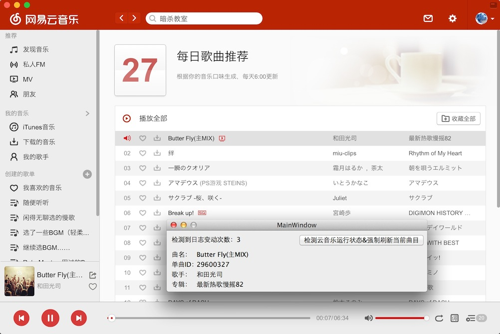
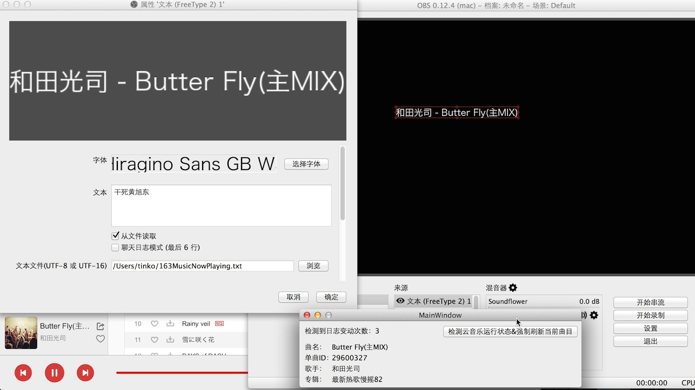

# NeteaseMusicNowPlaying
网易云音乐Mac版 监视正在播放曲目

将Mac版网易云音乐正在播放曲目名和歌手输出至TXT文件

TXT文件路径位于~/163MusicNowPlaying.txt

可配合OBS使用，效果如图

OBS若显示方块，请确认所选字体支持相关文字

中/日文推荐 冬青黑体简体中文

TODO:

常驻系统托盘

隐藏DOCK图标

可执行文件度盘下载链接：http://pan.baidu.com/s/1RIkea

尚在读大学的乱来码农的首个Qt程序，前辈们菊苣们有建议请尽情提